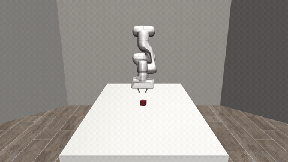
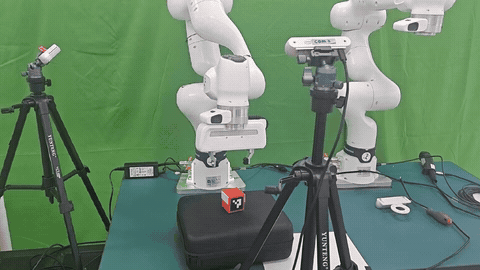
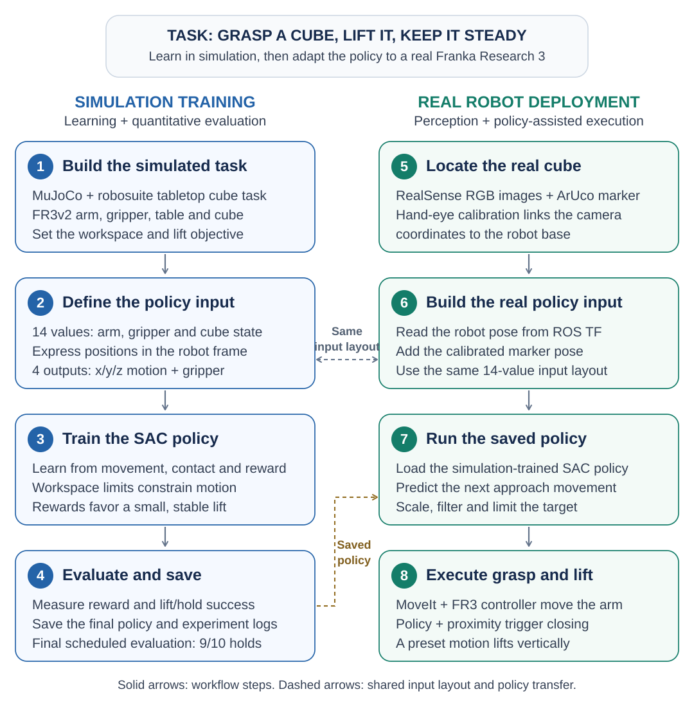
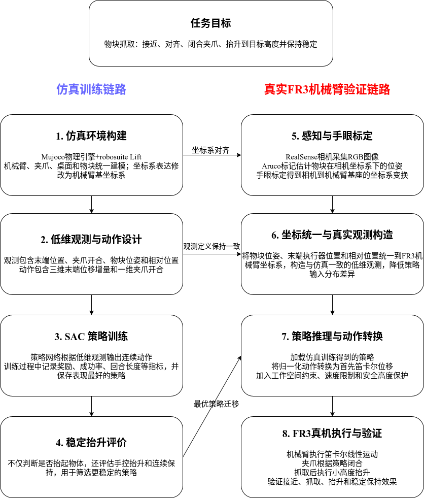
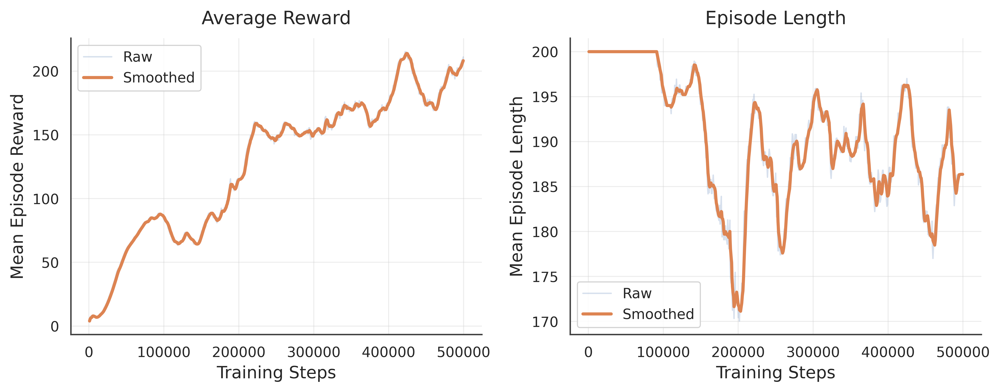
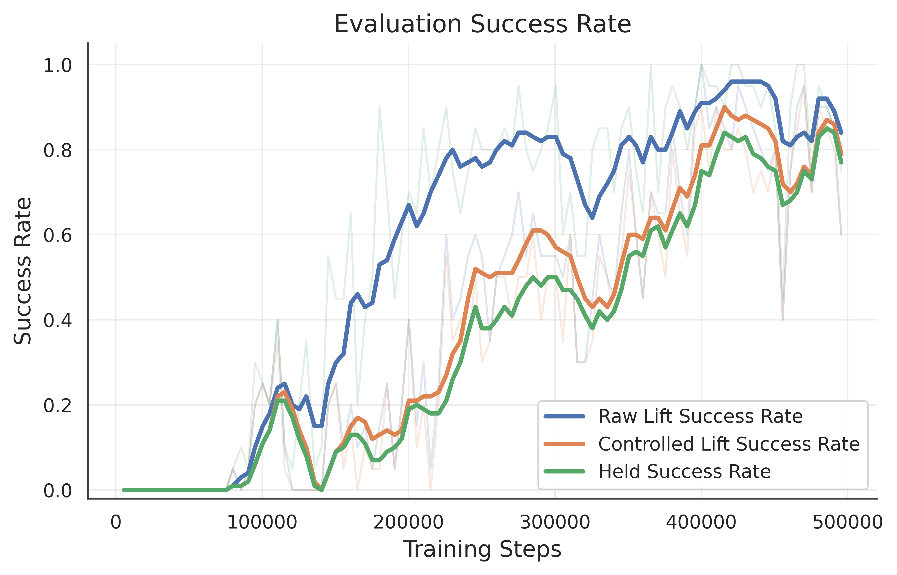

# Sim2Real Reinforcement Learning for Cube Grasping

**From MuJoCo simulation to a Franka Research 3 on a real desktop.**

This repository presents my undergraduate research at Nanjing University on learning a tabletop cube-grasping and lifting task, then adapting the trained policy to a real robot. I built a low-dimensional **Soft Actor-Critic (SAC)** training pipeline in **MuJoCo / robosuite**, added workspace constraints and a stable-hold objective, and completed a preliminary **Sim2Real demonstration on a Franka Research 3** using RealSense RGB images and ArUco pose estimation.

**Author:** [Chenliang Liu](https://github.com/Chenliang-Liu) · **Thesis:** *Research on Robotic Manipulation Algorithms Based on Reinforcement Learning* (2026)

## Highlights

- **Stability-aware learning:** train SAC to lift the cube to a target height and keep it steady, with workspace constraints and motion penalties.
- **Compact policy:** a 14-value observation and four continuous actions connect simulation training with the real deployment pipeline.
- **90% stable-hold success:** 9/10 episodes in the final scheduled simulation evaluation at 500,000 training steps.
- **Physical FR3 demonstration:** integrate RealSense sensing, ArUco pose estimation, camera calibration, and ROS 2 / MoveIt control to grasp and lift a real cube.

## Watch the experiments

| MuJoCo / robosuite simulation | Franka Research 3 real robot |
| :---: | :---: |
| [](assets/videos/sim_grasp.mp4) | [](assets/videos/real_grasp_web.mp4) |
| [Watch simulation video](assets/videos/sim_grasp.mp4) | [Watch browser-compatible real video](assets/videos/real_grasp_web.mp4) |

Previews show the supplied full videos at their original speed, sampled at 8 FPS and without audio. The original [real recording](assets/videos/real_grasp.mp4) is also included; the browser copy uses H.264 and omits audio. These are demonstrations, rather than a repeated-trial real-robot success-rate benchmark. The exact checkpoint used in each recording was not recorded in the supplied files.

## What I investigated

Lifting a cube briefly is a weaker goal than lifting it to a useful height and keeping it steady. A policy can receive a high return while continuing to move, overshooting the intended height, or taking an entire episode without meeting a stable-hold condition.

The simulation implementation therefore combines:

- **A compact state representation:** 14 values describing end-effector position, gripper opening, cube position and orientation, and relative cube position.
- **Continuous task-space actions:** three normalized position increments and one gripper action, passed through an `OSC_POSITION` controller.
- **Workspace-aware action processing:** convert normalized actions to controller displacement units, clip intended targets, and map the clipped displacement back to the controller input.
- **Controlled lifting and stability:** reward and measure a small target lift, penalize excessive height and motion, restrict horizontal movement after grasping, and require consecutive stable control steps for success.
- **A real deployment bridge:** construct the policy observation from robot TF and ArUco estimates, scale and filter Cartesian targets, and use the external FR3 planning/control stack.

The real implementation combines learned approach motion with threshold-gated gripper closing and a fixed vertical lift routine. It is a practical policy-transfer demonstration; the real lift phase is not entirely generated by SAC.

## Task settings and success criteria

The key simulation settings are summarized below. Height and stability thresholds are the training script's defaults.

| Setting | Value |
| --- | --- |
| Learning algorithm | Soft Actor-Critic (SAC) |
| Policy observation | 14 values: end-effector position, gripper opening, cube position and quaternion, and relative position |
| Policy action | Four values: three normalized Cartesian position increments and one gripper command |
| Simulation control | 20 Hz with `OSC_POSITION` |
| Training duration | 500,000 steps |
| Episode limit | 200 control steps (10 simulation seconds) |
| Target cube-center height above the table | 7.5 cm, with a tolerance of ±2.5 cm |
| Stable holding | Meet the height condition with cube speed ≤4 cm/s and end-effector speed ≤6 cm/s for 10 consecutive steps (0.5 seconds) |

The three success measures are **raw lift**, **controlled lift**, and **stable hold**. The reported 90% result uses the stable-hold criterion. See the [simulation guide](docs/simulation.md#success-definitions) for the full definitions and thresholds.

## How the system works

The project has two connected workflows: learn and evaluate a policy in simulation, then combine that saved policy with real perception and robot control.

[](assets/figures/system_overview.svg)

- **Left: learn in simulation.** Build the cube-grasping task, define the state and actions, train SAC, and evaluate reward and lifting stability. Save the checkpoints and logs.
- **Right: use the policy on FR3.** Locate the cube with the camera, express its pose in robot coordinates, construct the policy input, and run the saved policy. Robot motion uses MoveIt and the FR3 controller; closing uses the policy's request plus proximity rules, followed by a preset vertical lift.

The dashed arrows show what transfers: the **14-value input layout** and the **saved policy**. The real measurements and control behavior differ from simulation; matching the input layout does not make them identical.

This diagram follows the two-column framework from my thesis, with English labels and the implementation details clarified. The original figure is included below for comparison.

<details>
<summary>Original thesis framework figure (Chinese)</summary>
<p></p>
</details>

See the [simulation implementation](docs/simulation.md) and [Sim2Real deployment guide](docs/sim2real.md) for the exact data layout, thresholds, commands, and implementation limits. The deployment guide also includes a [detailed perception and coordinate-frame diagram](docs/sim2real.md#perception-and-coordinate-frames).

## Recorded simulation results

At **500,000 training steps**, the final scheduled training evaluation achieved **90% stable-hold success: 9 successful episodes out of 10**. Success requires lifting the cube to the target height and keeping it steady for consecutive control steps.

| Training steps | Stable-hold success | Mean episode return ± SD | Mean episode length (steps) |
| ---: | ---: | ---: | ---: |
| 500,000 | 90% (9 / 10) | 38.40 ± 19.32 | 59.2 |

This is a strong result for the simulated task: the policy completed the stable grasp-and-lift objective in most evaluated episodes, with a mean episode length of **59.2 control steps** (about **3 seconds** at 20 Hz).

### Average reward and episode length



The thesis training curves show an overall increase in average reward, indicating improved performance under the training reward. Episode length tends to move below the 200-step limit as learning progresses, consistent with more efficient task completion. The raw and smoothed curves show the trend alongside the variation between episodes.

### Evaluation success rate



Raw lifting improves first, followed by substantial gains in controlled lifting and stable holding. The later training stages show much higher success across all three measures, supporting the progression from learning to lift the cube to maintaining a controlled, stable grasp.

These are the original figures from my thesis. They summarize training and evaluation trends; the table reports the final scheduled 10-episode evaluation from the archived logs. The [results report](docs/results.md) explains the metric definitions and data sources, including the separate TensorBoard evaluation batches and saved-checkpoint timing.

## Explore the repository

```text
.
├── train_sim/
│   ├── train_osc_position_lowdim_workspace.py
│   └── fr3v2_baseframe_lift_h0075_vertical/
│       ├── final_model/      # SAC checkpoint at 500,000 steps
│       ├── eval_logs/        # original evaluations.npz
│       └── tb/               # original TensorBoard event files
├── fr3_sim2real/              # ArUco detector, policy runner, FR3 controller
├── docs/
│   ├── simulation.md         # training, observations, actions, rewards
│   ├── sim2real.md           # setup, eight-terminal map, deployment
│   ├── results.md            # evidence, metrics, limitations
│   └── terminal_logs/        # sanitized historical terminal records
├── assets/                   # figures, original videos, GIF previews
├── results/                  # derived JSON and CSV summaries
├── scripts/                  # log analysis, workflow diagram, video previews
├── tests/                    # hardware-free execution-gate tests
└── thesis/                   # original final PDF and LaTeX sources
```

## Start with the saved evidence

You can inspect the experiment without a robot or simulation installation:

```bash
git clone https://github.com/Chenliang-Liu/fr3-sim2real-rl-grasping.git
cd fr3-sim2real-rl-grasping
python -m pip install -r requirements-analysis.txt
python scripts/summarize_evaluations.py
```

Open [the final thesis PDF](thesis/robot-rl-thesis.pdf), read the [results report](docs/results.md), or inspect the saved logs:

```bash
tensorboard --logdir train_sim/fr3v2_baseframe_lift_h0075_vertical/tb
```

## Training and real-robot reproduction

The supplied files are a research archive with documented reproduction requirements:

1. **The custom robosuite `FR3v2` integration is still needed.** Its robot/gripper definitions and assets are absent from the supplied project folder. The public training script also supports Panda, but a Panda run is a different configuration from the saved FR3v2 experiment.
2. **A configured ROS 2 / Franka / MoveIt workspace** is required for the real arm. The included [`fr3_controller.py`](fr3_sim2real/fr3_controller.py) supplies the action-client bridge; the robot packages, planning configuration, services, and calibrated TF frames must be provided by the deployment environment.

Model metadata records Python 3.10.19, Stable-Baselines3 2.7.1, PyTorch 2.10.0+cu128, NumPy 2.2.6, and Gymnasium 1.2.3. The original robosuite and MuJoCo versions and complete environment lockfile were not included. [requirements-sim.txt](requirements-sim.txt) reconstructs the known core versions and lists the remaining packages, with those limits stated explicitly.

- Follow [simulation setup and training](docs/simulation.md) for verified CLI options and a reconstruction of the training configuration.
- Follow [the real-robot guide](docs/sim2real.md) for the eight terminal roles and dependency-based startup order. Terminal numbering is not the launch order.
- The public policy runner requires `--execute` for its reset, grasp, approach, and lift calls; the [hardware-free tests](tests/test_real_execution_gate.py) verify those guards. Importing the included controller creates no robot motion, and its constructor initializes ROS clients without sending motion goals. Running `fr3_controller.py` directly starts a separate physical-motion demo; use the policy runner and the documented procedure.

The real policy runner uses a synthetic gripper-open value and does not verify successful object capture or check the controller's boolean return values. Its detector currently publishes the marker origin, despite comments describing a cube-center offset. These observation and execution differences are detailed in the deployment guide.

## Thesis and provenance

The [final PDF](thesis/robot-rl-thesis.pdf) is the supplied submitted thesis. The [LaTeX source](thesis/robot-rl-thesis.tex) is the supplied source version and can differ from that PDF; this repository does not claim to have regenerated the submitted document. [thesis/README.md](thesis/README.md) describes the source and template dependencies.

Original training code, the final checkpoint, evaluation data, and event files are retained. The public deployment runner has the small execution-gate/import changes listed in [PUBLICATION_NOTES.md](PUBLICATION_NOTES.md). Terminal records have workstation identifiers and device identifiers replaced with placeholders. [The artifact manifest](results/artifact_manifest.json) records SHA-256 hashes and the relationship between supplied and published files.

## Acknowledgements and terms

This project builds on [MuJoCo](https://mujoco.org/), [robosuite](https://robosuite.ai/), [Stable-Baselines3](https://stable-baselines3.readthedocs.io/), [Gymnasium](https://gymnasium.farama.org/), [ROS 2](https://docs.ros.org/en/humble/), [MoveIt](https://moveit.ai/), [Franka Robotics](https://franka.de/), and [RealSense](https://github.com/realsenseai/realsense-ros). The thesis uses the Nanjing University `njuthesis` template.

Licensing and third-party notices are recorded in [THIRD_PARTY_NOTICES.md](THIRD_PARTY_NOTICES.md). The thesis, media, and template are separate from any license applied to the research Python code.
